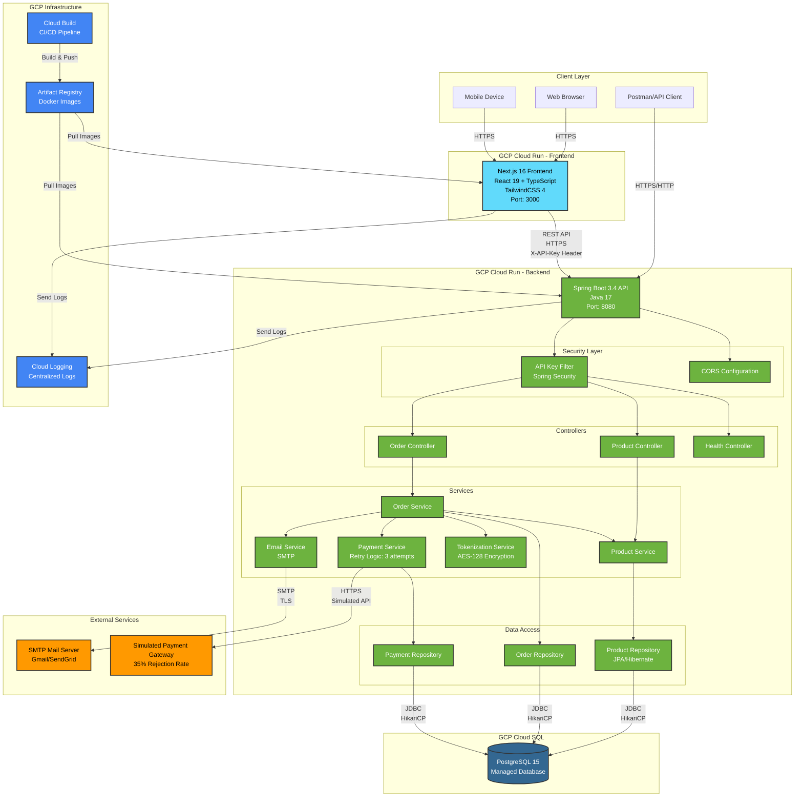
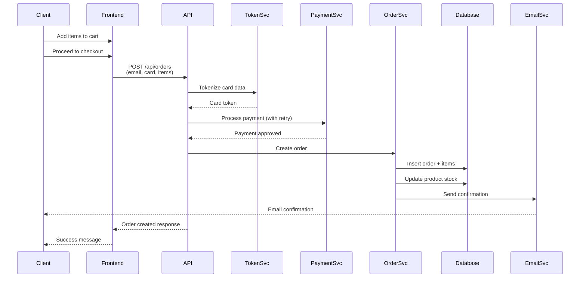
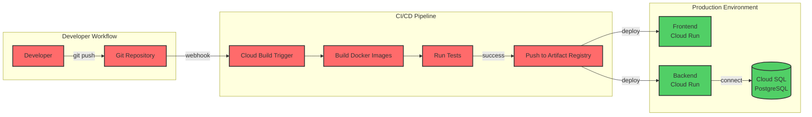

# Farmatodo Challenge - Architecture Diagram

## System Architecture Overview

## Component Details

### Frontend Layer (Next.js)
- **Technology**: Next.js 16 with App Router
- **Framework**: React 19
- **Language**: TypeScript
- **Styling**: TailwindCSS 4
- **Port**: 3000
- **Features**:
  - Server-side rendering (SSR)
  - Product catalog with animations
  - Shopping cart management
  - Order checkout flow
  - Real-time stock updates

### Backend Layer (Spring Boot)
- **Technology**: Spring Boot 3.4
- **Language**: Java 17
- **Port**: 8080
- **Key Components**:
  - **API Key Filter**: Validates X-API-Key header for all protected endpoints
  - **CORS**: Configured for frontend domain access
  - **Controllers**: REST endpoints for products, orders, health
  - **Services**: Business logic layer with transaction management
  - **Repositories**: JPA/Hibernate data access layer

### Security & Authentication
- **Protocol**: API Key based authentication
- **Header**: `X-API-Key: SECRET123`
- **Encryption**: AES-128 for card tokenization
- **HTTPS**: All external communications encrypted

### Database Layer
- **Database**: PostgreSQL 15 (Cloud SQL)
- **Connection Pool**: HikariCP
- **ORM**: JPA/Hibernate
- **Features**:
  - Transactional integrity
  - Optimistic locking for concurrent access
  - Auto-schema updates

### External Services
1. **Payment Gateway** (Simulated)
   - Protocol: HTTPS
   - Retry Logic: Up to 3 attempts
   - Configurable rejection rate: 35%

2. **Email Service** (SMTP)
   - Protocol: SMTP with TLS
   - Purpose: Order confirmations
   - Provider: Gmail/SendGrid

### GCP Infrastructure
1. **Cloud Run**
   - Serverless container platform
   - Auto-scaling: 0-10 instances
   - Pay-per-use pricing

2. **Cloud Build**
   - Automated CI/CD pipeline
   - Multi-stage Docker builds
   - Artifact Registry integration

3. **Artifact Registry**
   - Docker image storage
   - Separate repos for frontend/backend
   - Image versioning with tags

4. **Cloud Logging**
   - Centralized log aggregation
   - Real-time monitoring
   - Log retention and analysis

## Data Flow

### Order Creation Flow

## Network Protocols

| Communication | Protocol | Port | Security |
|--------------|----------|------|----------|
| Browser ↔ Frontend | HTTPS | 443 | TLS 1.3 |
| Frontend ↔ Backend | HTTPS | 443 | TLS 1.3 + API Key |
| Backend ↔ Database | JDBC over TCP | 5432 | Cloud SQL Proxy |
| Backend ↔ SMTP | SMTP/TLS | 587 | TLS |
| Backend ↔ Payment API | HTTPS | 443 | TLS 1.3 |

## Deployment Architecture

## Technology Stack Summary

### Frontend
- **Runtime**: Node.js 20
- **Framework**: Next.js 16
- **UI Library**: React 19
- **Styling**: TailwindCSS 4
- **Animation**: Framer Motion
- **HTTP Client**: Fetch API
- **Testing**: Jest + React Testing Library

### Backend
- **Runtime**: Java 17 (Eclipse Temurin)
- **Framework**: Spring Boot 3.4
- **Security**: Spring Security 6.5
- **Data Access**: Spring Data JPA
- **Connection Pool**: HikariCP
- **Testing**: JUnit 5 + Mockito
- **Build Tool**: Gradle 8.10

### Database
- **RDBMS**: PostgreSQL 15
- **Hosting**: GCP Cloud SQL
- **Connection**: JDBC with SSL
- **ORM**: Hibernate 6.x

### Infrastructure
- **Container Platform**: GCP Cloud Run
- **Container Registry**: Google Artifact Registry
- **CI/CD**: Google Cloud Build
- **Monitoring**: Google Cloud Logging
- **Container**: Docker (multi-stage builds)

## Scalability & Performance

- **Auto-scaling**: 0-10 instances per service
- **Cold start**: ~2-3 seconds
- **Response time**: <200ms (p95)
- **Concurrent requests**: Handled by Cloud Run auto-scaling
- **Database connections**: Pooled with HikariCP (max 10)
- **Rate limiting**: Configurable per service

## Security Features

1. **API Authentication**: X-API-Key header validation
2. **Card Tokenization**: AES-128 encryption
3. **HTTPS**: All communications encrypted
4. **SQL Injection**: Prevented by JPA/Hibernate
5. **CORS**: Configured for trusted origins
6. **Secrets Management**: Environment variables (upgradeable to Secret Manager)
7. **Container Security**: Non-root user execution
8. **Database**: Private IP, Cloud SQL Auth Proxy

---

**Note**: This architecture is designed for the Farmatodo technical challenge and demonstrates cloud-native best practices with containerization, microservices patterns, and automated CI/CD.
